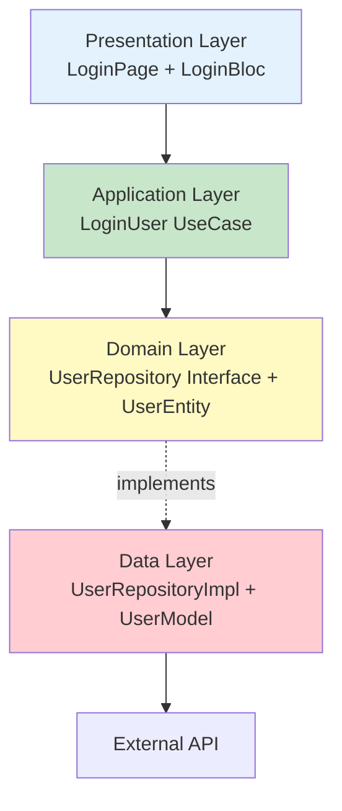

# Clean Architecture - Visual Flow Diagram

## Copy this into draw.io, excalidraw.com, or any diagramming tool

### Layered Architecture View

```
┏━━━━━━━━━━━━━━━━━━━━━━━━━━━━━━━━━━━━━━━━━━━━━━━━━━━━━━━━━━━━━━┓
┃  PRESENTATION LAYER                                            ┃
┃  ┌────────────┐        ┌────────────┐        ┌────────────┐  ┃
┃  │ LoginPage  │───────▶│ LoginBloc  │───────▶│   Events   │  ┃
┃  │  Widget    │        │            │        │  & States  │  ┃
┃  └────────────┘        └────────────┘        └────────────┘  ┃
┗━━━━━━━━━━━━━━━━━━━━━━━━━━━┳━━━━━━━━━━━━━━━━━━━━━━━━━━━━━━━━━━┛
                             │
                             ▼
┏━━━━━━━━━━━━━━━━━━━━━━━━━━━┻━━━━━━━━━━━━━━━━━━━━━━━━━━━━━━━━━━┓
┃  APPLICATION LAYER                                             ┃
┃                    ┌────────────┐                              ┃
┃                    │ LoginUser  │                              ┃
┃                    │  UseCase   │                              ┃
┃                    └────────────┘                              ┃
┗━━━━━━━━━━━━━━━━━━━━━━━━┳━━━━━━━━━━━━━━━━━━━━━━━━━━━━━━━━━━━━┛
                         │
                         ▼
┏━━━━━━━━━━━━━━━━━━━━━━━━┻━━━━━━━━━━━━━━━━━━━━━━━━━━━━━━━━━━━━┓
┃  DOMAIN LAYER (CORE)                                           ┃
┃  ┌────────────┐              ┌──────────────────┐             ┃
┃  │UserEntity  │              │ UserRepository   │             ┃
┃  │(Pure Data) │              │  <<interface>>   │             ┃
┃  └────────────┘              └─────────▲────────┘             ┃
┗━━━━━━━━━━━━━━━━━━━━━━━━━━━━━━━━━━━━━━━┃━━━━━━━━━━━━━━━━━━━━┛
                                         ┃ implements
┏━━━━━━━━━━━━━━━━━━━━━━━━━━━━━━━━━━━━━━━┻━━━━━━━━━━━━━━━━━━━━┓
┃  DATA LAYER                                                    ┃
┃  ┌─────────────────┐       ┌────────────────────┐            ┃
┃  │   UserModel     │◀──────│UserRepositoryImpl  │            ┃
┃  │(Entity + JSON)  │       │   (API Calls)      │            ┃
┃  └─────────────────┘       └────────────────────┘            ┃
┗━━━━━━━━━━━━━━━━━━━━━━━━━━━━━━━━━┳━━━━━━━━━━━━━━━━━━━━━━━━━━┛
                                  │
                                  ▼
                          ┌──────────────┐
                          │ Backend API  │
                          └──────────────┘
```

## Sequence Diagram: User Login Flow

```
User         LoginPage      LoginBloc     LoginUser    UserRepository    API
 │               │              │             │              │            │
 │  Enter Email  │              │             │              │            │
 ├──────────────▶│              │             │              │            │
 │               │ EmailChanged │             │              │            │
 │               ├─────────────▶│             │              │            │
 │               │              │             │              │            │
 │ Enter Pass    │              │             │              │            │
 ├──────────────▶│              │             │              │            │
 │               │ PassChanged  │             │              │            │
 │               ├─────────────▶│             │              │            │
 │               │              │             │              │            │
 │ Click Login   │              │             │              │            │
 ├──────────────▶│              │             │              │            │
 │               │LoginSubmitted│             │              │            │
 │               ├─────────────▶│             │              │            │
 │               │              │   call()    │              │            │
 │               │              ├────────────▶│              │            │
 │               │              │             │  login()     │            │
 │               │              │             ├─────────────▶│            │
 │               │              │             │              │ POST /auth │
 │               │              │             │              ├───────────▶│
 │               │              │             │              │            │
 │               │              │             │              ◀────────────┤
 │               │              │             │              │ JSON       │
 │               │              │             │ UserModel    │            │
 │               │              │             ◀──────────────┤            │
 │               │              │ UserEntity  │              │            │
 │               │              ◀─────────────┤              │            │
 │               │ LoginSuccess │             │              │            │
 │               ◀──────────────┤             │              │            │
 │ Show Success  │              │             │              │            │
 ◀───────────────┤              │             │              │            │
```

## Key Points for Diagram

### Box Labels
- **PRESENTATION**: Flutter Widgets + Bloc/Cubit
- **APPLICATION**: Use Cases (Business Logic)
- **DOMAIN**: Entities + Repository Interfaces
- **DATA**: Models + Repository Implementations

### Arrow Direction (Critical!)
- All arrows point INWARD (dependency flow)
- Outer layers depend on inner layers
- Inner layers NEVER import outer layers

### Color Coding Suggestion
- 🟦 Blue: Presentation (UI concerns)
- 🟩 Green: Application (Use Cases)
- 🟨 Yellow: Domain (Core Business)
- 🟥 Red: Data (External I/O)

## Files to Create This In:

1. **draw.io** (diagrams.net)
   - Open https://app.diagrams.net/
   - Use "UML" shapes
   - Add layers as rectangles
   - Connect with arrows

2. **Excalidraw** (excalidraw.com)
   - Clean, hand-drawn style
   - Easy to share as PNG
   - Collaborative

3. **Mermaid** (markdown-native)
   - Can be embedded in GitHub README
   - Auto-renders in many tools

4. **Pen & Paper**
   - Draw boxes and arrows
   - Take photo
   - Save as architecture_diagram.png

## Mermaid Code (for GitHub)



---

**Next Step:** Open any diagramming tool and recreate this structure visually. Save as `architecture_diagram.png` in the `docs/` folder.
