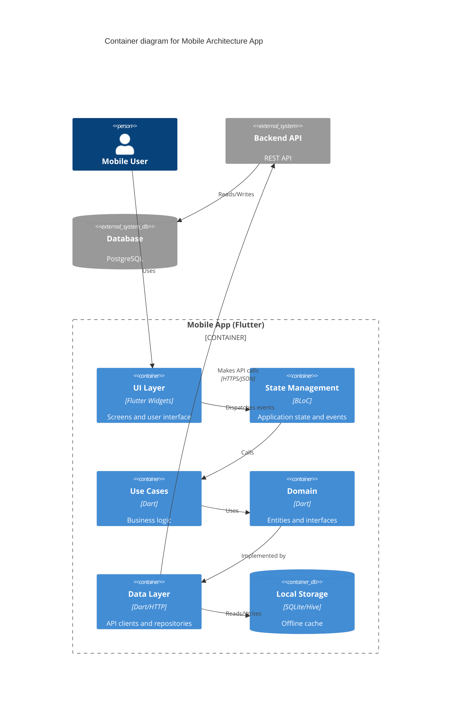

# C4 Model - Container Diagram

## Level 2: Container View

Shows the high-level technology choices and how containers (applications, data stores, etc.) interact within the Mobile Architecture system.

```
                              ┌─────────────────────┐
                              │                     │
                              │   Mobile User       │
                              │                     │
                              └──────────┬──────────┘
                                         │
                                         │ Uses
                                         │
                                         ▼
┌─────────────────────────────────────────────────────────────────────────┐
│  Mobile Architecture App (Flutter)                                      │
│                                                                          │
│  ┌────────────────────────┐         ┌────────────────────────┐         │
│  │                        │         │                        │         │
│  │  Flutter UI Layer      │────────▶│  State Management      │         │
│  │  (Presentation)        │         │  (BLoC/Cubit)          │         │
│  │                        │         │                        │         │
│  │  - Widgets             │         │  - Events/States       │         │
│  │  - Screens             │         │  - Business workflows  │         │
│  │  - Navigation          │         │                        │         │
│  └────────────────────────┘         └───────────┬────────────┘         │
│                                                  │                      │
│                                                  │ Calls                │
│                                                  ▼                      │
│                                     ┌────────────────────────┐         │
│                                     │                        │         │
│                                     │  Use Cases Layer       │         │
│                                     │  (Application)         │         │
│                                     │                        │         │
│                                     │  - Business Logic      │         │
│                                     │  - Validation          │         │
│                                     │                        │         │
│                                     └───────────┬────────────┘         │
│                                                 │                      │
│                                                 │ Uses                 │
│                                                 ▼                      │
│                                     ┌────────────────────────┐         │
│                                     │                        │         │
│                                     │  Domain Layer          │         │
│                                     │  (Entities & Repos)    │         │
│                                     │                        │         │
│                                     │  - Pure entities       │         │
│                                     │  - Interfaces          │         │
│                                     │                        │         │
│                                     └───────────┬────────────┘         │
│                                                 │                      │
│                                                 │ Implemented by       │
│                                                 ▼                      │
│  ┌────────────────────────┐         ┌────────────────────────┐        │
│  │                        │         │                        │        │
│  │  Local Storage         │◀────────│  Data Layer            │        │
│  │  (SQLite/Hive)         │         │  (Repositories)        │        │
│  │                        │         │                        │        │
│  │  - Offline cache       │         │  - API clients         │────────┼──┐
│  │  - User preferences    │         │  - Data mapping        │        │  │
│  │  - Session data        │         │  - Error handling      │        │  │
│  │                        │         │                        │        │  │
│  └────────────────────────┘         └────────────────────────┘        │  │
│                                                                         │  │
└─────────────────────────────────────────────────────────────────────────┘  │
                                                                              │
                                                                              │ HTTPS/JSON
                                                                              │
                                         ┌────────────────────────────────────┘
                                         │
                                         ▼
                          ┌──────────────────────────────────┐
                          │                                  │
                          │       Backend API                │
                          │       (REST API Server)          │
                          │                                  │
                          │  - Express.js / Spring Boot      │
                          │  - JWT Authentication            │
                          │  - JSON responses                │
                          │                                  │
                          └────────────┬─────────────────────┘
                                       │
                                       │ Reads/Writes
                                       │
                                       ▼
                          ┌──────────────────────────────────┐
                          │                                  │
                          │    Database                      │
                          │    (PostgreSQL/MySQL/MongoDB)    │
                          │                                  │
                          │  - User accounts                 │
                          │  - Application data              │
                          │  - Session tokens                │
                          │                                  │
                          └──────────────────────────────────┘
```

## Container Details

### Mobile App Containers

| Container | Technology | Purpose | Responsibility |
|-----------|-----------|---------|----------------|
| **Flutter UI Layer** | Flutter/Dart, Material Design | Presentation | - Display UI<br>- Handle user input<br>- Navigation<br>- Show loading/error states |
| **State Management** | flutter_bloc, equatable | Application State | - Manage UI state<br>- Handle events<br>- Emit states<br>- Coordinate workflows |
| **Use Cases Layer** | Pure Dart | Business Logic | - Input validation<br>- Business rules<br>- Orchestrate operations<br>- Return Result types |
| **Domain Layer** | Pure Dart | Core Models | - Define entities<br>- Define interfaces<br>- Business constraints<br>- No framework dependencies |
| **Data Layer** | Dart, http package | Data Access | - Call REST APIs<br>- Map JSON to models<br>- Handle network errors<br>- Implement repositories |
| **Local Storage** | sqflite / hive | Persistence | - Offline data cache<br>- User preferences<br>- Session storage<br>- Queue pending requests |

### External Containers

| Container | Technology | Purpose |
|-----------|-----------|---------|
| **Backend API** | Node.js/Java/Python | Business logic, authentication, data management |
| **Database** | PostgreSQL/MySQL/MongoDB | Persistent data storage |
| **Analytics Service** | Firebase/Mixpanel SDK | Event tracking and metrics |

## Key Interactions

### 1. User Input Flow
```
User taps button → 
  UI dispatches event → 
    Bloc receives event → 
      Calls use case → 
        Use case validates → 
          Calls repository → 
            Repository calls API → 
              Stores in local cache → 
                Returns result → 
                  Bloc emits new state → 
                    UI updates
```

### 2. Offline Handling
```
API request fails → 
  Repository catches error → 
    Checks local cache → 
      Returns cached data if available → 
        Queues request for retry → 
          User sees stale data with indicator
```

### 3. Authentication Flow
```
User submits credentials → 
  LoginBloc triggers LoginUseCase → 
    UseCase validates input → 
      Repository calls POST /auth/login → 
        Backend validates → 
          Returns JWT token → 
            Repository stores token securely → 
              Stores user data in local storage → 
                Bloc emits LoginSuccess → 
                  UI navigates to home
```

## Technology Stack

### Mobile App
```yaml
Frontend Framework: Flutter 3.x
Language: Dart 3.x
State Management: flutter_bloc ^9.1.1
Dependency Injection: get_it / riverpod
Local Storage: sqflite / hive
HTTP Client: dio / http
Serialization: json_serializable / freezed
Error Handling: Custom Result<L,R> type
Testing: flutter_test, mockito, bloc_test
```

### Backend (Assumed)
```
API Framework: Express.js / Spring Boot / FastAPI
Database: PostgreSQL / MySQL / MongoDB
Authentication: JWT
API Style: REST (JSON)
```

## Container Boundaries

### What Runs on Device
- ✅ Flutter application (all layers)
- ✅ Local SQLite/Hive database
- ✅ Cached API responses
- ✅ Analytics SDK

### What Runs on Server
- ❌ Backend API
- ❌ Database
- ❌ Authentication service
- ❌ Analytics processing

## Data Flow Patterns

### Synchronous (UI → Logic)
```
UI Layer → State Management → Use Case → Domain → Data
```

### Asynchronous (Network → UI)
```
API Response → Data Layer → Domain Entity → Use Case Result → Bloc State → UI Update
```

### Offline-First Pattern
```
1. Check local cache first
2. Display cached data immediately
3. Fetch from API in background
4. Update cache and UI when response arrives
5. Queue writes when offline
```

## Deployment Model

```
┌─────────────────────────────────────────────────┐
│  Development                                    │
│  ┌───────────────┐       ┌──────────────────┐  │
│  │ Local Flutter │  ───▶ │ Android Emulator │  │
│  │ Development   │       │ / iOS Simulator  │  │
│  └───────────────┘       └──────────────────┘  │
└─────────────────────────────────────────────────┘

┌─────────────────────────────────────────────────┐
│  Production                                     │
│  ┌───────────────┐       ┌──────────────────┐  │
│  │ Compiled      │  ───▶ │ App Stores       │  │
│  │ APK / IPA     │       │ (Play/App Store) │  │
│  └───────────────┘       └──────────────────┘  │
└─────────────────────────────────────────────────┘
```

## Communication Protocols

| From | To | Protocol | Data Format |
|------|-----|----------|-------------|
| UI Layer | State Management | In-process (Events/States) | Dart objects |
| State Management | Use Cases | Function calls | Dart objects |
| Use Cases | Repositories | Function calls | Domain entities |
| Repositories | Backend API | HTTPS/REST | JSON |
| App | Local Storage | SQLite queries | SQL |
| App | Analytics | HTTPS/SDK | JSON events |

## Security Considerations

| Container | Security Measures |
|-----------|------------------|
| **Mobile App** | - Code obfuscation<br>- Certificate pinning<br>- No hardcoded secrets<br>- Secure token storage |
| **Local Storage** | - Encrypted sensitive data<br>- flutter_secure_storage for tokens<br>- No PII in logs |
| **API Communication** | - HTTPS only<br>- JWT Bearer tokens<br>- Token refresh mechanism<br>- Request timeout handling |

## Mermaid Diagram



---

**Diagram Level:** C4 - Level 2 (Container)  
**Audience:** Technical team, architects, senior developers  
**Purpose:** Show technology choices and container interactions  
**Previous Level:** See `context.md` for system context  
**Next Level:** Component diagrams for internal structure of each container
