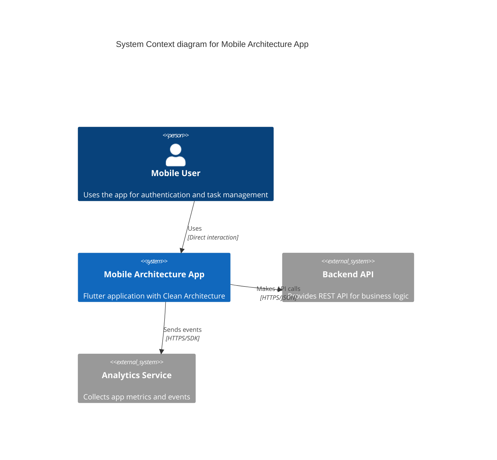

# C4 Model - Context Diagram

## Level 1: System Context

The highest level view showing the mobile architecture system and its interactions with users and external systems.

```
                                    ┌─────────────────────┐
                                    │                     │
                                    │   Mobile User       │
                                    │   (Person)          │
                                    │                     │
                                    └──────────┬──────────┘
                                               │
                                               │ Uses mobile app
                                               │ for authentication
                                               │ and features
                                               │
                                               ▼
                    ┌──────────────────────────────────────────────────┐
                    │                                                  │
                    │         Mobile Architecture App                  │
                    │         (Flutter Application)                    │
                    │                                                  │
                    │  Provides authentication, user management,       │
                    │  and core business features with offline         │
                    │  capability and clean architecture               │
                    │                                                  │
                    └───────────┬──────────────────────┬───────────────┘
                                │                      │
                                │ Makes API            │ Sends
                                │ calls over           │ analytics
                                │ HTTPS/JSON           │ events
                                │                      │
                                ▼                      ▼
                  ┌──────────────────────┐   ┌──────────────────────┐
                  │                      │   │                      │
                  │   Backend API        │   │  Analytics Service   │
                  │   (External System)  │   │  (External System)   │
                  │                      │   │                      │
                  │  Provides REST API   │   │  Tracks user events  │
                  │  for authentication, │   │  and app metrics     │
                  │  user data, and      │   │  (e.g., Firebase)    │
                  │  business logic      │   │                      │
                  │                      │   │                      │
                  └──────────────────────┘   └──────────────────────┘
```

## System Description

### People

| Actor | Description | Responsibilities |
|-------|-------------|------------------|
| **Mobile User** | End user of the mobile application | - Authenticates with email/password<br>- Interacts with app features<br>- Receives notifications<br>- Views and manages data |

### Software Systems

| System | Type | Description | Technology |
|--------|------|-------------|------------|
| **Mobile Architecture App** | Internal System | Cross-platform mobile application implementing Clean Architecture principles | Flutter, Dart |
| **Backend API** | External System | RESTful API providing business logic and data persistence | To be determined (Node.js/Java/Python) |
| **Analytics Service** | External System | Collects and processes user behavior and app metrics | Firebase Analytics / Mixpanel |

## Key Interactions

### 1. User → Mobile App
- **Protocol:** Direct UI interaction
- **Data:** User inputs (email, password, form data)
- **Response:** UI feedback, navigation, data display

### 2. Mobile App → Backend API
- **Protocol:** HTTPS/REST
- **Authentication:** JWT tokens (Bearer authentication)
- **Data Format:** JSON
- **Operations:**
  - `POST /auth/login` - User authentication
  - `POST /auth/register` - User registration
  - `GET /users/me` - Fetch user profile
  - `PUT /users/me` - Update user profile
  - `GET /api/tasks` - Fetch user tasks
  - `POST /api/tasks` - Create new task

### 3. Mobile App → Analytics Service
- **Protocol:** HTTPS / SDK
- **Data:** Event tracking (page views, button clicks, errors)
- **Purpose:** Monitor app usage, performance, and crashes

## System Boundaries

### What's Inside (Our Responsibility)
- ✅ Mobile application architecture
- ✅ Client-side business logic
- ✅ Local data persistence
- ✅ State management
- ✅ Offline-first capabilities

### What's Outside (External Dependencies)
- ❌ Backend API implementation
- ❌ Database management
- ❌ Server infrastructure
- ❌ Analytics processing
- ❌ Push notification service

## Non-Functional Requirements

| Requirement | Description |
|-------------|-------------|
| **Performance** | - Cold start < 3 seconds<br>- UI frame rate: 60 FPS<br>- API response timeout: 30 seconds |
| **Availability** | - Offline mode for core features<br>- Graceful degradation when API unavailable |
| **Security** | - Secure token storage<br>- HTTPS only<br>- No sensitive data in logs |
| **Compatibility** | - Android 6.0+ (API 23+)<br>- iOS 12.0+ |
| **Scalability** | - Support 10,000+ concurrent users<br>- Handle large datasets (pagination) |

## Future External Systems (Planned)

```
┌──────────────────────┐       ┌──────────────────────┐
│                      │       │                      │
│  Push Notification   │       │  Cloud Storage       │
│  Service             │       │  (Images/Files)      │
│  (Firebase/OneSignal)│       │  (AWS S3/Firebase)   │
│                      │       │                      │
└──────────────────────┘       └──────────────────────┘
```

## Deployment Context

```
┌─────────────────────────────────────────────────────┐
│  Distribution                                       │
│                                                     │
│  ┌─────────────────┐      ┌─────────────────┐     │
│  │  Google Play    │      │  Apple App      │     │
│  │  Store          │      │  Store          │     │
│  └─────────────────┘      └─────────────────┘     │
│                                                     │
└─────────────────────────────────────────────────────┘
                        │
                        ▼
                ┌───────────────┐
                │  End User     │
                │  Devices      │
                └───────────────┘
```

## Key Architectural Decisions

1. **Clean Architecture** - Enables testability and maintainability
2. **Offline-first** - App works without network connectivity
3. **JWT Authentication** - Stateless, scalable auth mechanism
4. **REST API** - Industry standard, well-supported
5. **Flutter** - Single codebase for iOS and Android

## Mermaid Diagram (for GitHub)



---

**Diagram Level:** C4 - Level 1 (Context)  
**Audience:** Business stakeholders, project managers, architects  
**Purpose:** Show the big picture and system boundaries  
**Next Level:** See `container.md` for internal architecture details
